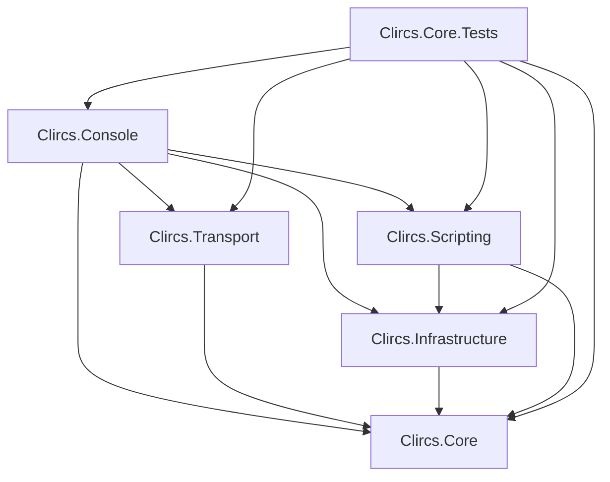

# clircs architecture

This document describes the architecture of the current clircs development tree. It is a contributor guide, not a wishlist. The source code and this document describe the current application.

clircs is a Windows-native console IRC client built on C# and .NET 10. Its core design goal is straightforward: protocol state must remain authoritative and independent from whatever happens to be visible in the terminal. A channel does not cease to exist because its window is hidden, a script does not infer modes by scraping output, and a second network never shares the first network's nickname or channel state.

## The short version

There are five production projects and one test project. `Clircs.Console` produces the executable:

| Project | Owns | Must not own |
| --- | --- | --- |
| `Clircs.Core` | IRC framing/parsing, connection/session logic, state, commands, protection models, DCC models | Windows console drawing, concrete sockets, files, JavaScript |
| `Clircs.Transport` | Concrete TCP/TLS and DCC socket transports | IRC presentation, application routing, persistent policy |
| `Clircs.Infrastructure` | Durable files, network profiles, user directories, certificate pins, Windows-protected credentials | Live connections and terminal state |
| `Clircs.Scripting` | Sandboxed JavaScript lifecycle and capability enforcement | Unrestricted CLR, filesystem, process, or network access |
| `Clircs.Console` | Startup, composition, commands, live-session coordination, routing, logging, windows, input, rendering | Reimplementing the IRC parser or transport |
| `Clircs.Core.Tests` | Executable unit, transcript, integration, security, and regression suite | Production behavior |

The dependency direction is:



`Clircs.Console` is both the composition root and the terminal application. That is why it references every other production project. The lower projects do not reference it.

## One incoming PRIVMSG, end to end

This is the most useful path to understand first:

```mermaid
flowchart LR
    Socket[TCP or TLS socket]
    Transport[TcpIrcTransport]
    Connection[IrcClientConnection]
    Framer[IrcLineFramer]
    Parser[IrcMessageParser]
    Session[IrcNetworkSession]
    Processor[IrcSessionProcessor]
    State[NetworkSessionState]
    Event[SessionEvent]
    Pump[InboundSessionEventPump]
    Application[ClientApplication event routing]
    History[Window history]
    Sinks[Presenter / logger / scripts]

    Socket --> Transport --> Connection --> Framer --> Parser --> Session --> Processor
    Processor --> State
    Processor --> Event --> Pump --> Application --> History --> Sinks
```



### 1. Socket and TLS

`TcpIrcTransportFactory` in `Clircs.Transport` resolves and opens the TCP connection. For TLS endpoints it wraps the network stream in `SslStream`, supplies an optional client certificate for SASL EXTERNAL, and delegates server-certificate decisions to `ITlsCertificatePolicy`.

The concrete transport implements `IIrcTransport`, the small socket boundary defined in `Clircs.Core`. Core networking therefore knows how to read, write, close, and describe a connection without knowing how Windows opened it.

### 2. Bytes become an IRC message

`IrcClientConnection.ReceiveLoopAsync` reads chunks into a 16 KiB working buffer. `IrcLineFramer` turns arbitrary TCP chunks into complete IRC payloads and enforces the 510-byte payload limit. `IrcTextEncoding` decodes a line, then `IrcMessageParser` creates an immutable `IrcMessage` containing prefix, command, and parameters.

`IrcClientConnection` owns connection-level protocol behavior:

- connection and registration states;
- `PASS`, `NICK`, and `USER` registration;
- IRCv3 `CAP` negotiation on every connection, requesting `multi-prefix` and configured SASL support when advertised;
- SASL PLAIN and EXTERNAL exchanges;
- immediate `PING`/`PONG` handling;
- nickname fallback during registration;
- exact raw-wire observation for the debug window;
- the per-connection outbound scheduler.

It does **not** own channel membership, WHOIS aggregation, window selection, or terminal output.

### 3. The network session applies IRC meaning

`IrcNetworkSession` wraps one `IrcClientConnection`, one `NetworkSessionState`, and one `IrcSessionProcessor`. It is the public live-network boundary used by the application.

Incoming messages are processed serially in wire order. Before handing a message to the processor, the session handles concerns that require connection context: self-echo suppression, CTCP replies and their limiter, registration completion, reconnect restoration, bouncer synchronization, connection health, and session lifecycle notifications.

`IrcSessionProcessor.Process` applies the message to authoritative IRC state and emits zero or more `SessionEvent` records. Large numeric families are separated into focused collaborators:

- `IdentityQueryResponseProcessor` owns WHO, WHOIS, and WHOWAS correlation and aggregation;
- `NetworkQueryResponseProcessor` owns network-level result families such as MOTD, LINKS, and LIST-adjacent replies;
- `ChannelListResponseProcessor` owns channel list modes such as `b`, `e`, `I`, and `q`.

The main processor still owns ordinary IRC events such as PRIVMSG, NOTICE, JOIN, PART, QUIT, NICK, TOPIC, MODE, NAMES, and `005` feature updates.

### 4. State changes before display

`NetworkSessionState` is the authoritative state for one live network. It owns:

- the stable `NetworkSessionId`;
- network display and advertised identities;
- the current IRC case mapping;
- status, channel, query, result, debug, and DCC buffer identities;
- `ChannelState` instances;
- user modes, TLS/bouncer metadata, and other synchronized session facts.

Each `ChannelState` owns its topic, channel modes, synchronized list modes, and `ChannelMemberState` collection. Dictionaries use the server's negotiated IRC case mapping rather than ordinary .NET case-insensitive comparison. If `005 CASEMAPPING` changes, state is deliberately reindexed and rejects ambiguous merges.

The terminal is never the source of these facts.

### 5. Typed events cross into the application

`SessionEvent` is the principal boundary between protocol/session code and the application. It carries:

- `NetworkSessionId` and `BufferId`;
- a semantic `SessionEventKind`;
- plain safe text and timestamp;
- semantic fields used for routing and automation;
- optional `PresentationBlock` data for tables, grids, and labeled information;
- optional parsed IRC formatting.

`SessionEventBuilder` sanitizes remote terminal controls while preserving supported IRC text formatting as data. Remote text is not written directly to the Windows console.

`IrcNetworkSession.EventRaised` sends the event to `ClientApplication.QueueInboundSessionEvent`. The bounded `InboundSessionEventPump` lets the socket return to reading without waiting for console drawing, preserves event order, and delivers events to the application in batches.

### 6. Application routing and side effects

`ClientApplication.DispatchSessionEvent` is the application pipeline. In order, it can:

1. reject an event hidden by personal protection;
2. record away messages;
3. evaluate personal and channel protection;
4. process DCC negotiation events;
5. normalize highlights and join/cycle state;
6. resolve pending request and configured output routes;
7. store the event in the destination window history;
8. enqueue semantic logging;
9. draw it when its buffer is active;
10. publish the semantic event to scripts;
11. update window lifecycle, activity, and highlight echoes.

This order matters. For example, protection evaluates semantic evidence rather than rendered strings, and logging records the routed semantic event rather than scraping console cells.

The executable `SessionEventDispatchStages` list makes that ordering contract inspectable and testable. A small dispatch context carries the current event and facts derived by earlier stages through six named phases: admission and away state, protection and DCC, output routing, history storage, event delivery, and window completion. A stage can stop delivery explicitly when an event is ignored, suppressed by routing, or cannot be stored. The phase methods remain on `ClientApplication` because they coordinate application-owned services; there is deliberately no interface or class hierarchy for stages that have only one implementation.

### 7. History and presentation

`WindowStateRegistry` owns and internally synchronizes terminal-only state keyed by `BufferId`: stable window number, unread categories, scroll offset, and `WindowEventHistory`. It also owns the currently active session and buffer selection. Callers receive immutable history and chrome snapshots; the live ring buffer never escapes its owner.

`WindowEventHistory` is ring storage. Appending new events and aging old events from the front are constant-time operations. `ScrollbackRetention` keeps at least 500 entries, normally retains the most recent day, and imposes explicit emergency limits of 250,000 events per window and 500,000 across the application.

`ViewportHistory` selects only the event rows required for the current viewport. At the live bottom of a window it walks backward only far enough to fill the screen; explicit scrollback navigation may calculate the complete rendered row count so it can clamp offsets correctly.

`ConsolePresenter` is the only component that performs terminal drawing and input editing. It owns:

- full-screen console entry and restoration;
- input, cursor movement, completion, and per-window command history;
- IRC formatting mapped onto the Windows console palette;
- tables, grids, information boxes, wrapping, and hyperlinks;
- buffer headers, status bar, prompt, and redraw coordination;
- resize and scroll rendering;
- batching so a burst does not redraw terminal chrome for every event.

The presenter receives semantic events and immutable chrome models. It does not query the IRC socket or decide channel state.

## Outbound commands

Interactive input travels in the opposite direction:

```mermaid
flowchart LR
    Input[ConsolePresenter.ReadLine]
    Parse[CommandLineParser]
    Lane[CommandExecutionCoordinator]
    Registry[CommandRegistry]
    Handler[ClientApplication command handler]
    Session[IrcNetworkSession]
    Builder[IrcLineBuilder]
    Queue[IrcOutboundScheduler]
    Transport[IIrcTransport]

    Input --> Parse --> Lane --> Registry --> Handler --> Session --> Builder --> Queue --> Transport
```



`CommandLineParser` distinguishes slash commands, chat text, quoted arguments, and escaped input. `CommandExecutionCoordinator` provides one serialized command lane and captures the `NetworkSessionId`/`BufferId` context in which the command began. A slow command cannot accidentally resume later against whatever window became active in the meantime.

`ClientApplication.CommandCatalog.cs` registers canonical command names, aliases, help, and handlers. Handlers are grouped by domain:

| File | Main responsibility |
| --- | --- |
| `ClientApplication.Commands.Network.cs` | server, network profiles, connection control, windows, autojoin |
| `ClientApplication.Commands.Channel.cs` | joins, modes, topics, bans, channel operations |
| `ClientApplication.Commands.MessagingAndDcc.cs` | messages, notices, CTCP, DCC commands and presentation |
| `ClientApplication.Commands.UsersAndProtection.cs` | user directories, mass operations, channel/personal protection |
| `ClientApplication.Commands.QueriesAndSettings.cs` | WHO/WHOIS, LIST/LINKS/MOTD, settings, themes, scripts, debug |

Handlers validate application context, update request-routing state when needed, and call `IrcNetworkSession`. They never write directly to the socket.

`IrcLineBuilder` validates IRC structure and length. `IrcOutboundScheduler` provides bounded priority queues, pacing, and a single writer per connection. Critical traffic such as PONG and registration bypasses ordinary pacing but has its own small emergency queue. User commands, automation, protection, and scripts all use this same outbound boundary.

## Live sessions versus saved networks

Three concepts that sound similar are deliberately different:

- `NetworkProfile` is persistent configuration for a logical network.
- `IrcNetworkSession` is the IRC protocol/state object for one live or reconnectable connection.
- `LiveNetworkSession` is application runtime metadata around that session: saved-profile association, connection route, reconnect cancellation, notify state, join attempts, and owned background work.

`LiveNetworkSessionRegistry` is the sole collection owner for those application runtimes. This avoids the former failure mode of keeping related session facts in parallel dictionaries that could drift apart.

Stable typed IDs are used instead of display strings:

- `NetworkProfileId` survives profile renaming;
- `NetworkSessionId` distinguishes simultaneous connections;
- `BufferId` distinguishes windows even when two networks contain the same channel name;
- DCC and user records have their own stable IDs.

Human-readable names are presentation and lookup data, not global identity.

## Reply routing

Many IRC commands produce several numerics later. The active window may change before those replies arrive.

`OutputRoutingCoordinator` solves this with two forms of temporary correlation:

- family routes for reply families that can have only one outstanding request per session;
- request-ID routes for families such as WHO and WHOIS that support overlapping requests.

Processors attach `outputFamily`, `outputRequestId`, and `outputEnd` semantics to events. The application resolves those fields to a `BufferId` and removes temporary routes when the response completes. User-configured defaults such as active, status, or dedicated output are applied when a command begins, not guessed when its final numeric arrives.

## `ClientApplication` and its partial files

`ClientApplication` is the process-level composition root and coordinator. It intentionally sees all application services, but its implementation is split by responsibility:

| File | Responsibility |
| --- | --- |
| `ClientApplication.cs` | construction, settings load, main input loop, shutdown, local command-result storage |
| `ClientApplication.SessionLifecycle.cs` | connect, registration, reconnect, autojoin, notify/MONITOR, synchronization, live-session cleanup |
| `ClientApplication.EventRouting.cs` | inbound application pipeline, response routing, logging, window delivery |
| `ClientApplication.Windowing.cs` | active-window selection, viewport, header, prompt, status bar |
| `ClientApplication.ProtectionRuntime.cs` | protection evidence, exemptions, actions, audit events |
| `ClientApplication.DccRuntime.cs` | DCC negotiation interpretation and shared DCC runtime helpers |
| `ClientApplication.CommandCatalog.cs` | command registration and help metadata |
| `ClientApplication.Commands.*.cs` | command handlers grouped by domain |
| `ClientApplication.Utilities.cs` | small application-level helpers shared across those parts |

These are one C# class, not separate services pretending to be independent. Shared invariants therefore remain visible, while large domains with real resource ownership have dedicated coordinators.

When new code makes `ClientApplication` acquire another durable collection, socket lifecycle, timer family, or state machine, that is a signal to create or extend an owning component rather than add another parallel dictionary.

## Concurrency and resource ownership

clircs uses several explicit serialized lanes rather than allowing arbitrary tasks to mutate shared state:

| Lane/owner | Guarantee |
| --- | --- |
| `IrcClientConnection.ReceiveLoopAsync` | One ordered inbound protocol stream per connection |
| `IrcOutboundScheduler` | One paced writer per IRC connection |
| `InboundSessionEventPump` | Ordered, batched transfer from sessions to the application |
| `SerializedEventDispatcher` | Application presentation/routing actions do not interleave |
| `CommandExecutionCoordinator` | One interactive/script command executes at a time with captured context |
| `SessionWorkTracker` | Background work is owned, cancellable, reportable, and awaited during shutdown |
| `DccCoordinator` | Request resources and tasks are associated with one DCC request ID |
| `ScriptInstance` callback queue | Each script receives serialized, bounded callbacks |
| `EventLogWriter` | One bounded asynchronous logging worker |

Important hard boundaries include:

- 510-byte IRC payloads and at most 15 IRC parameters;
- 512 ordinary and 32 critical pending outbound IRC operations per connection;
- 100,000 pending inbound application events;
- 100,000 pending semantic log entries;
- 4,096-byte DCC CHAT lines;
- 250,000 history events per window and 500,000 application-wide;
- bounded automatic query creation, script callbacks, timers, commands, headers, and WebSockets.

At the large inbound/log/history emergency boundaries, clircs disconnects the producing network and reports the reason. It does not silently lose traffic while pretending that the connection remains trustworthy.

Mutable collections are synchronized by their domain owners. `WindowStateRegistry` owns terminal-window state, `ChannelSynchronizationCoordinator` owns automatic WHO and clone-scan correlation, and `SessionTransientState` owns timed bans, autojoin admission, and away acknowledgements. Existing owners such as `ChannelState`, `LiveNetworkSessionRegistry`, `OutputRoutingCoordinator`, `DccCoordinator`, and the persistent stores likewise protect their own data.

`ClientApplication` retains one deliberately narrow `_windowTransactionGate`. It is used only when a core IRC buffer and its terminal window must be created, selected, stored, or removed as one operation. Ordinary reads do not use it, expensive viewport measurement happens from immutable snapshots after state locks are released, and unrelated coordinators are not nested beneath it.

## DCC subsystem

DCC begins as IRC CTCP negotiation but becomes a separate transport system after endpoints are agreed.

`DccOfferParser` and `DccResumeParser` convert untrusted CTCP payloads into typed offers and resume controls. `DccRequestRegistry` owns request IDs and legal state transitions. `ClientApplication.RouteDccProtocolEvent` correlates incoming negotiation with the correct IRC network and request.

`DccCoordinator` owns application-side runtime resources for each request:

- expiration timers;
- active or passive listeners;
- pending connectors;
- live CHAT sessions and their buffers;
- SEND source/receive state;
- active transfer progress;
- resume state;
- request-owned background tasks.

Concrete DCC sockets and TLS live in `Clircs.Transport`. File receive/send transports stream data rather than loading complete files into memory. `DccDownloadStore` owns safe download naming, collision avoidance, and resumable partial-file metadata.

DCC requests retain their originating `NetworkSessionId`; nickname alone is never sufficient identity. Closing a network invalidates its pending DCC negotiation and cancels or closes related resources through explicit lifecycle paths.

SCHAT and SSEND provide encrypted transport but intentionally accept the peer's self-signed ephemeral certificate without identity verification. Current DCC negotiation does not provide a portable authenticated certificate identity. This is documented protocol behavior, not general TLS policy and must not leak into ordinary IRC-server certificate validation.

## User directories and protection

Persistent user records are scoped to `NetworkProfileId`, because they describe a logical network rather than one temporary socket. `UserDirectoryStore` reads and commits those records. `NetworkUserDirectory` performs IRC-aware hostmask and role matching.

`UserAndChannelPolicyCoordinator` owns the mutable runtime shared by user automation and protection:

- cached network user directories;
- protection counters;
- temporary personal ignores;
- action cooldowns and reservations;
- per-channel automation gates.

`ClientApplication.ProtectionRuntime.cs` translates `SessionEvent` semantics into evidence, applies scoped settings and userlist exemptions, and schedules actions through the ordinary session outbound scheduler. Protection does not parse rendered lines and does not get a direct socket bypass.

## Persistence and secrets

`Clircs.Infrastructure` owns persistent network profiles, network credentials, user directories, and certificate pins. Console-level stores own appearance, logging rules, protection settings, away messages, themes, and backups because those formats are application/UI policy.

Small state files use `DurableFileWriter`: write a unique temporary file, flush it, then atomically replace/move the destination while optionally retaining `.bak`. A process-wide reader/writer boundary lets `/backup` obtain a coherent snapshot rather than racing active commits.

Secrets that clircs must recover—SASL passwords, server passwords, script secrets, and certificate-bundle passwords—use Windows DPAPI scoped to the current Windows user. Values that only need future verification should use one-way password hashing instead of recoverable encryption.

TLS server validation is strict by default. `TlsCertificatePromptPolicy` may accept once or pin an exact certificate to an exact host and port. Expired certificates are never silently trusted. Raw debug output is deliberately raw and may expose passwords or reversible SASL PLAIN payloads; opening and logging that window is an explicit debugging decision.

## Scripting boundary

`ScriptManager` discovers manifests, owns load/unload/reload, persists desired load state and grants, and publishes semantic `SessionEvent` objects to loaded scripts. Each `ScriptInstance` owns a Jint engine and a serialized bounded callback queue.

Scripts may register commands, observe scoped events, store private data, use Windows-protected secrets, create bounded timers, contribute constrained header items, and request IRC operations after permission is granted. The host does not expose arbitrary CLR access, process launch, registry access, raw sockets, unrestricted files, or external network access. The optional `localnetwork` permission is limited to loopback WebSockets.

Script commands return through the same command execution lane. Script IRC actions return through `IrcNetworkSession` and the same outbound scheduler as built-in behavior.

## Presentation is semantic, not stringly terminal art

Ordinary events have semantic kinds and fields. Structured output uses `PresentationBlock`, `PresentationField`, and `PresentationTable`. Those structures preserve complete underlying values and optional IRC formatting; `ConsolePresenter` decides how much fits the current width.

This distinction matters for resize behavior, clickable URLs, logging, and themes. Do not pre-truncate domain values merely to make one terminal width look tidy. Preserve the complete value and express layout constraints in presentation metadata.

`SessionEvent.Fields` remains a flexible integration seam used by protocol processors, routing, protection, DCC, logging, and scripts. When adding a field:

1. give it a stable domain name;
2. sanitize any remote value before it crosses into application code;
3. add behavioral tests at every consumer boundary;
4. prefer a typed property or typed interpretation when several components depend on the same invariant.

`SessionEventPresentation` is an example of consolidating commonly consumed field semantics instead of repeatedly decoding strings throughout the renderer.

## Tests

The test project is a small executable runner rather than xUnit/NUnit. Tests register named asynchronous or synchronous cases with `TestSuite`; failures include the case name and stack trace.

The suite covers several levels:

- parser, framing, encoding, and case-mapping units;
- transcript-driven session/state behavior;
- real loopback TCP registration and multi-session isolation;
- SASL and TLS policy;
- DCC negotiation, sockets, file transfer, passive operation, and resume;
- command parsing and orchestration;
- output routing and presentation semantics;
- terminal measurement, scrolling, resize, wrapping, control sanitization, and hyperlink behavior;
- persistence damage/failure behavior and Windows-protected secrets;
- scripting permissions and resource limits;
- protection, flood resilience, and emergency boundaries.

Run the normal verification from the repository root:

```powershell
dotnet build clircs.sln -c Release
dotnet run --project tests/Clircs.Core.Tests/Clircs.Core.Tests.csproj -c Release
```

Some Schannel tests require a normal Windows user certificate-key environment and may fail in restricted or application-controlled environments. Run those tests from an ordinary Windows user session before treating the failures as product regressions.

## Where to make common changes

| Change | Start here | Usually also inspect |
| --- | --- | --- |
| Add or format an IRC numeric | matching response processor or `IrcSessionProcessor` | `SessionEventBuilder`, routing tests, presentation tests |
| Add a protocol command | `ClientApplication.CommandCatalog.cs` and the appropriate `Commands.*.cs` | `IrcNetworkSession`, help tests |
| Change channel/user state | `NetworkSessionState`, `ChannelState`, `ChannelMemberState` | session processor and transcript tests |
| Change status bar/header/prompt | `ClientApplication.Windowing.cs` | `ConsolePresenter`, `TerminalTheme`, theme tests |
| Change event appearance | `ConsolePresenter` and `SessionEventPresentation` | presentation/theme tests |
| Add saved network behavior | `NetworkProfile` and `NetworkProfileStore` | credentials, migration, session lifecycle |
| Add a TLS rule | `TcpIrcTransportFactory` and certificate policy interfaces | `TlsCertificatePromptPolicy`, trust-store tests |
| Change DCC negotiation | DCC parsers/models and `ClientApplication.DccRuntime.cs` | `DccCoordinator`, transport and DCC tests |
| Change protection/userlist behavior | `UserAndChannelPolicyCoordinator` and protection runtime | stores, role/mask matching, protection tests |
| Add script API surface | scripting contracts and `ScriptInstance` | permissions, limits, script tests |
| Change history/scrolling | `WindowStateRegistry`, `WindowEventHistory`, `ViewportHistory` | presenter measurement and flood tests |

## Architectural rules for contributors

These rules protect invariants that previous audits found worth making explicit:

1. **Never identify a network, buffer, DCC request, or user record solely by its display name.** Use the stable typed ID and the server's IRC case mapping where names must be compared.
2. **Do not write IRC bytes directly from commands, scripts, DCC negotiation, or protection.** Use the owning session and scheduler.
3. **Do not derive protocol state from terminal output.** Update core state first, then emit semantic events.
4. **Do not send remote control characters directly to the console.** Preserve supported IRC formatting as parsed data and sanitize terminal controls.
5. **Do not create unowned background tasks.** Attach them to `SessionWorkTracker`, `DccCoordinator`, a script instance, or another explicit lifecycle owner.
6. **Do not add an unbounded queue or collection on a remote-input path.** Choose a failure policy and test the boundary.
7. **Do not keep related mutable session facts in parallel dictionaries.** Put them in the object that owns that lifecycle.
8. **Do not pre-truncate semantic values for the current terminal width.** Let presentation choose visible width and recover the full value after resize.
9. **Do not silently swallow invalid persistent state.** Preserve damaged files, report the failure, and avoid replacing them with defaults without evidence.
10. **Do not grant scripts a shortcut around application authorization or validation.** Script operations pass through the same domain boundaries as built-in commands.

## A practical reading order

For a new contributor—or for learning the codebase without attempting to absorb it all at once—this order gives the clearest picture:

1. `Program.cs`
2. `ClientApplication.cs` constructor and `RunAsync`
3. `ClientApplication.SessionLifecycle.cs` session creation
4. `IrcClientConnection.cs` receive and send paths
5. `IrcNetworkSession.cs` message handling
6. `IrcSessionProcessor.cs` plus the response-family processors
7. `NetworkSessionState.cs` and `ChannelState.cs`
8. `SessionEvent.cs` and `PresentationBlock.cs`
9. `ClientApplication.EventRouting.cs`
10. `WindowStateRegistry.cs`, `ViewportHistory.cs`, and `ClientApplication.Windowing.cs`
11. `ConsolePresenter.cs`
12. One domain of interest: commands, DCC, protection/userlists, persistence, or scripting

At that point, an incoming IRC line and an outgoing user command should both be traceable without treating `ClientApplication` or `ConsolePresenter` as magic.
