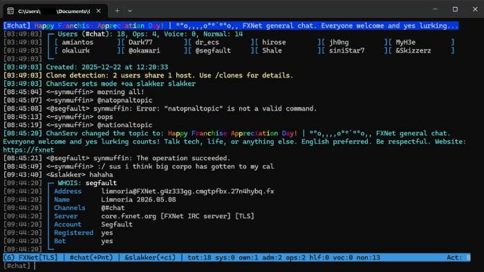
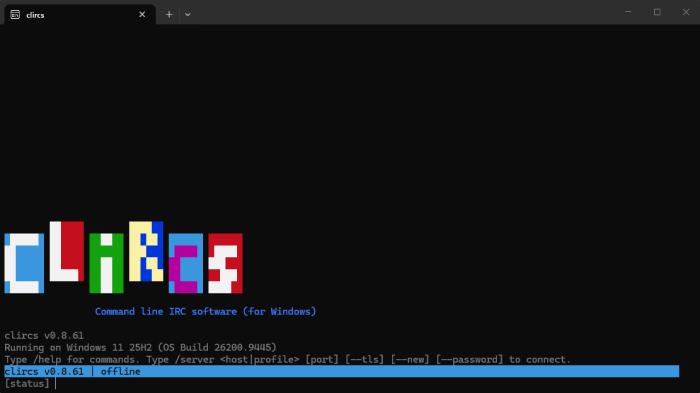
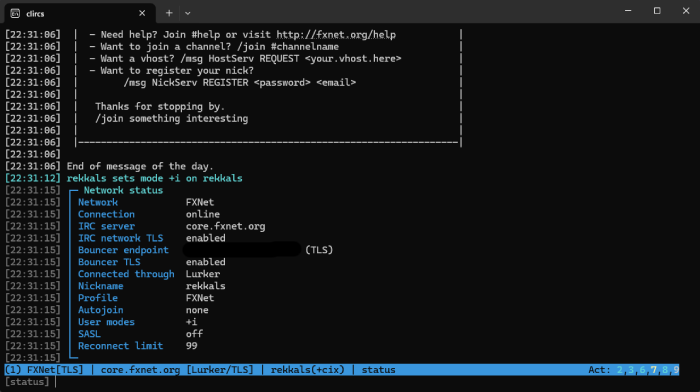

# clircs

Command line IRC software (for Windows)



clircs is a Windows-native console IRC client written in C# for .NET 10 with scriptability via Jint. It does not require WSL or Cygwin to run. That's actually the whole point of the client.

That, and for it to be useful out of the box. I've always disliked what I've come to call "the WordPress approach," where you get supposedly amazing software, but it doesn't do much until you install a bunch of other shit. Yes, the beauty of IRC is that it's decentralized and extensible and customizable. That's why I love it. But two things can exist at the same time, and in this case, that other thing is some people really do just want to chat without learning how to script or any of that other nerd stuff.

Additionally, we're not all aboard the current IRCv3 "make IRC into Discord" train that's rolling through. clircs operates in "back to basics" territory.

## Current Version

This is the current development build, which includes normal IRC functions, multi-net, TLS, SASL, bouncer support, channel management, flood protection, logging, scripting, regular-old and the now-more-secure DCC SCHAT and SSEND including passive and resumed file transfers.

Support for all the various IRCds could be ... mixed, at least cosmetically. I'm an ircd-ratbox guy, and clircs is pretty solid on EFnet. But I make no promises that it won't display some things a little funny, depending on the IRCd and what it's running.

## Requirements

Windows 10 or Windows 11 and the .NET 10 SDK.

Precompiled packages and an installer will come later, but for now, you'll have to build it yourself from source. Don't worry, it's easy.

## Building and Running

Just clone the repository and build the solution:

```powershell
git clone https://github.com/rekkals/clircs.git
cd clircs
dotnet build clircs.sln
```

Then run clircs with:

```powershell
dotnet run --project src/Clircs.Console/Clircs.Console.csproj
```



## Connecting

You can connect to an IRC server with:

```text
/server <host> [port] [--tls] [--password]
```

Open a new network window with `--new`.

```text
/server irc.efnet.org 9999 --tls --new
```

You can also connect via SASL after setting up a network profile with `/network`.

### Bouncers

The following bouncers/proxies are compatible with clircs:

+ ZNC
+ soju
+ Lurker
+ IRCCloud
+ shroudBNC



## Help

Use `/help` for a list of commands and `/help <command>` for help with a `<command>`.

## More Info

[DOCUMENTATION](DOCUMENTATION.md) contains detailed user documentation, settings, command notes, scripting information, and current limitations.

[CONTRIBUTING](CONTRIBUTING.md) contains guidelines and instructions on how to contribute to the clircs project.

[SCRIPTING](SCRIPTING.md) contains info on adding scripts via Jint.

[VERSIONS](VERSIONS.txt) contains the glorious, me-struggling-through-C# version history.

[THIRD-PARTY-NOTICES](THIRD-PARTY-NOTICES.txt) contains third-party licensing notices as required.

## License

clircs is free software licensed under the GNU General Public License, either version 3 or (at your option) any later version. See [LICENSE](LICENSE).

## Contact

Report all issues (other than security) via GitHub at: https://github.com/rekkals/clircs/issues

Please send security issues by email: slakker@clircs.org

Join the #clircs IRC channel on EFnet: ircs://irc.efnet.org:9999/clircs | irc://irc.efnet.org/clircs
